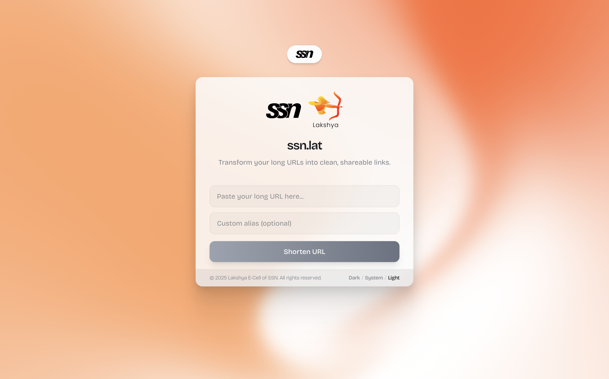

# ssn.lat (Lakshya's Advanced TinyURLs)



A modern, fast URL shortener built specifically for SSN College of Engineering students and the Lakshya E-Cell community. Transform your long URLs into clean, shareable links with custom aliases and real-time analytics.

## ✨ Features

- **🔗 URL Shortening**: Convert long URLs into short, memorable links
- **🎨 Custom Aliases**: Create personalized short codes for your links
- **📊 Click Tracking**: Monitor how many times your links are accessed
- **🌗 Dark/Light Mode**: Seamless theme switching
- **📱 Responsive Design**: Works perfectly on all devices
- **⚡ Real-time**: Instant URL shortening with live feedback
- **🎭 Smooth Animations**: Beautiful Framer Motion transitions
- **🎨 Modern UI**: Clean interface with Bricolage Grotesque font

## 🛠️ Tech Stack

- **Framework**: [Next.js 15](https://nextjs.org/) with App Router
- **Database**: [Supabase](https://supabase.com/) PostgreSQL
- **Styling**: [Tailwind CSS](https://tailwindcss.com/) with custom color system
- **Animations**: [Framer Motion](https://www.framer.com/motion/)
- **Background**: [Paper Design Shaders](https://github.com/paper-design/shaders-react) for animated mesh gradient
- **Typography**: [Bricolage Grotesque](https://fonts.google.com/specimen/Bricolage+Grotesque)
- **Icons**: [Lucide React](https://lucide.dev/)
- **Deployment**: Vercel-ready

## 🚀 Getting Started

### Prerequisites

- Node.js 18+
- npm or yarn
- Supabase account

### Installation

1. **Clone the repository**

   ```bash
   git clone https://github.com/yourusername/ssn.lat.git
   cd ssn.lat
   ```

2. **Install dependencies**

   ```bash
   npm install
   ```

3. **Set up Supabase**

   - Create a new project at [supabase.com](https://supabase.com)
   - Go to SQL Editor and run this schema:

   ```sql
   CREATE TABLE urls (
     id UUID DEFAULT gen_random_uuid() PRIMARY KEY,
     long_url TEXT NOT NULL,
     short_code TEXT NOT NULL UNIQUE,
     custom_alias TEXT,
     created_at TIMESTAMP WITH TIME ZONE DEFAULT NOW(),
     click_count INTEGER DEFAULT 0
   );

   CREATE INDEX idx_urls_short_code ON urls(short_code);
   ```

4. **Environment Setup**

   - Copy `.env.example` to `.env.local`
   - Fill in your Supabase credentials:

   ```env
   NEXT_PUBLIC_SUPABASE_URL=your_supabase_project_url
   NEXT_PUBLIC_SUPABASE_ANON_KEY=your_supabase_anon_key
   NEXT_PUBLIC_SITE_URL=https://ssn.lat
   ```

5. **Run the development server**

   ```bash
   npm run dev
   ```

   Open [http://localhost:3000](http://localhost:3000) in your browser.

## 🏗️ How It Works

### URL Shortening Process

1. **Input Validation**: User submits a long URL with optional custom alias
2. **Code Generation**: System generates a unique 6-character short code using Base62 encoding
3. **Database Storage**: URL mapping is stored in Supabase with metadata
4. **Response**: Returns shortened URL in format `https://ssn.lat/shortcode`

### Redirection Process

1. **Route Matching**: Next.js dynamic route `[shortCode]` captures the short code
2. **Database Lookup**: Query Supabase for the corresponding long URL
3. **Analytics Update**: Increment click counter for tracking
4. **Redirect**: Server-side redirect (with client-side fallback) to the original URL

### Code Structure

```
ssn.lat/
├── app/                    # Next.js App Router
│   ├── [shortCode]/       # Dynamic route for redirects
│   ├── api/shorten/       # URL shortening API endpoint
│   ├── layout.tsx         # Root layout with theme provider
│   └── page.tsx           # Main URL shortener interface
├── components/            # React components
│   ├── box/              # Main container wrapper
│   ├── header/           # Navigation header
│   ├── mesh-gradient.tsx # Animated background
│   └── ui/               # UI components
├── lib/
│   └── supabase.ts       # Supabase client configuration
└── public/               # Static assets
    ├── ssnlogo.webp      # SSN logo
    └── lakshya.png       # Lakshya E-Cell logo
```

## 🎨 Design Features

- **Animated Background**: Dynamic mesh gradient with orange/white color scheme
- **Logo Integration**: SSN College and Lakshya E-Cell branding
- **Theme Awareness**: SSN logo inverts to black in light mode
- **Micro-interactions**: Hover effects, loading states, and smooth transitions
- **Responsive**: Mobile-first design approach

## 📊 Database Schema

```sql
Table: urls
├── id (UUID, Primary Key)
├── long_url (TEXT, NOT NULL)
├── short_code (TEXT, UNIQUE, NOT NULL)
├── custom_alias (TEXT, NULLABLE)
├── created_at (TIMESTAMP WITH TIME ZONE, DEFAULT NOW())
└── click_count (INTEGER, DEFAULT 0)
```

## 🔧 API Reference

### POST /api/shorten

Create a new short URL.

**Request Body:**

```json
{
  "longUrl": "https://example.com/very/long/url",
  "customAlias": "mylink" // optional
}
```

**Response:**

```json
{
  "shortUrl": "https://ssn.lat/mylink",
  "shortCode": "mylink"
}
```

**Error Responses:**

- `400`: Invalid URL or custom alias already exists
- `500`: Internal server error

## 🚀 Deployment

### Vercel (Recommended)

1. Connect your GitHub repository to Vercel
2. Add environment variables in Vercel dashboard
3. Deploy automatically on push to main branch

### Manual Deployment

1. Build the project: `npm run build`
2. Start the production server: `npm start`

## 🤝 Contributing

We welcome contributions from the SSN community! Please read our contributing guidelines and feel free to submit pull requests.

## 📝 License

This project is open source and available under the [MIT License](LICENSE).

## 🏫 About

Built with ❤️ for **SSN College of Engineering** students by the **Lakshya E-Cell** community. This URL shortener serves our college community with a fast, reliable way to share links across campus activities, events, and projects.

---

**Made by the SSN Community | Powered by Lakshya E-Cell**
